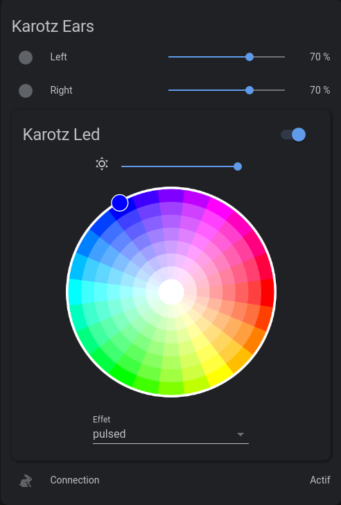
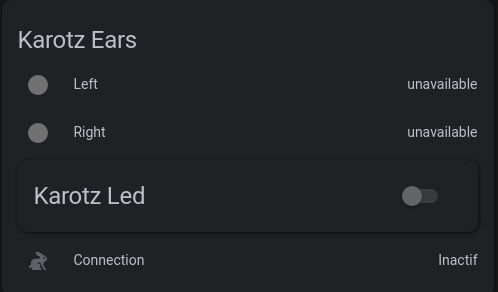
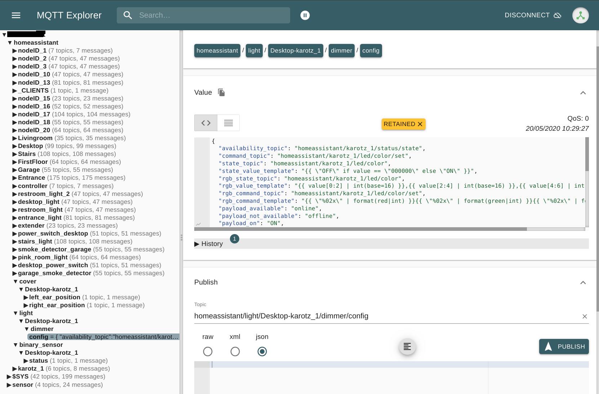
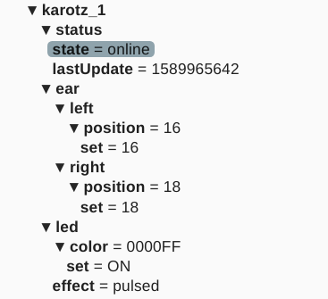

# karotz2mqtt
Homeassistant gateway for Karotz device through MQTT protocol.

- Karotz card when switched-on 



- Karotz card when switched-off



## Pre-requisites

You obviously have to take control of your favorite rabbit to be able to insert the gateway into the processes startup sequence. There are several way to do this, that I won't explain here. In my case I previously installed FreeRabbits OS and customized it a little to fit my needs. Feel free to do this as you want.

## Startup process

Ears and Led states/controls are registered into the broker as soon as the MQTT gateway is started.  Then Karotz device is automatically detected by homeassistant if discovery has been enabled. The gateway shall be setted up by the following valid command line arguments :

```
                        _           _                    
                       / \         / \                   
                       \  \       /  /                   
                        \  \     /  /                    
                         \  \___/  /                     
                         /         \                     
  ______               _|__ O   O  _|    _     _ _       
 |  ____|             |  __ \     | |   | |   (_) |      
 | |__ _ __ ___  ___  | |__) |____| |__ | |__  _| |_ ___ 
 |  __|  __/ _ \/ _ \ |  _  // _  |  _ \|  _ \| | __/ __|
 | |  | | |  __/  __/ | | \ \ (_| | |_) | |_) | | |_\__ \
 |_|  |_|  \___|\___| |_|  \_\____|____/|____/|_|\__|___/
                                                         

-bash-4.1# /usr/karotz/bin/karotz2mqtt -h

karotz2mqtt - Proxy mqtt for KAROTZ system
 usage: /usr/karotz/bin/karotz2mqtt [options]
 where options are:
  -h, --help              display this message and exit.
  -a, --about             output version information and exit.
  -d, --discovery-prefix  prefix for mqtt discovery.
  -m, --mqtt-prefix       prefix for mqtt topics.
  -b, --broker-address    mqtt broker address.
  -p, --broker-port       mqtt broker port.
  -u, --broker-username   mqtt broker username.
  -P, --broker-password   mqtt broker password.
  -l, --location          location setup.
  -v, --verbose           verbosity increase.
  -f,--flash              flashing period in ms
  
-bash-4.1# 
```

More command line options may come later as soon as this tool will be stable enough. Keep in mind that it's a beta release without warranty of being bug-free.

The process has a few dependencies as displayed hereafter :

```
-bash-4.1# ldd /usr/karotz/bin/karotz2mqtt 
	libuuid.so.1 => /usr/lib/libuuid.so.1 (0x4000e000)
	libzmq.so.1 => /usr/lib/libzmq.so.1 (0x4001a000)
	libdbus-1.so.3 => /usr/lib/libdbus-1.so.3 (0x4004f000)
	libmosquittopp.so.1 => /usr/lib/libmosquittopp.so.1 (0x4008b000)
	libpthread.so.0 => /lib/libpthread.so.0 (0x40099000)
	libstdc++.so.6 => /usr/lib/libstdc++.so.6 (0x400b3000)
	libm.so.0 => /lib/libm.so.0 (0x4015e000)
	libgcc_s.so.1 => /lib/libgcc_s.so.1 (0x40176000)
	libc.so.0 => /lib/libc.so.0 (0x40189000)
	libmosquitto.so.1 => /usr/lib/libmosquitto.so.1 (0x401e8000)
	librt.so.0 => /lib/librt.so.0 (0x40201000)
	ld-uClibc.so.0 => /lib/ld-uClibc.so.0 (0x40000000)
-bash-4.1# 
```

New ones are libzmq.so.1, libmosquittopp.so.1 and libmosquitto.so.1. I use the former for my internal software design but it may be removed in a future release. I obviously need the latter to manage MQTT protocol and the second library is only a C++ wrapper to main mosquitto library provided as C library code.

The process shall be started after all dbus daemons ( ears-daemon, led-daemon, voice-daemon,... ) as it connects itself to the system bus and controls the device through those proxies. As I found no way to be notified to daemons startup, I insert a short delay before starting the gateway by this way : 

```
-bash-4.1# cat /usr/scripts/startup.sh 
#!/bin/bash
...
function start_bricks {
    logger -s "[STARTUP] Start Immortaldog bricks"
    /usr/karotz/bin/immortaldog /var/run/karotz/led.pid /usr/karotz/bin/led-daemon >/dev/null 2>/dev/null
    /usr/karotz/bin/immortaldog /var/run/karotz/rfid.pid /usr/karotz/bin/rfid-daemon >/dev/null 2>/dev/null
    /usr/karotz/bin/immortaldog /var/run/karotz/webcam.pid /usr/karotz/bin/webcam-daemon >/dev/null 2>/dev/null
    /usr/karotz/bin/immortaldog /var/run/karotz/button.pid /usr/karotz/bin/button-daemon >/dev/null 2>/dev/null
    /usr/karotz/bin/immortaldog /var/run/karotz/ears.pid /usr/karotz/bin/ears-daemon >/dev/null 2>/dev/null
    /usr/karotz/bin/immortaldog /var/run/karotz/voice.pid /usr/karotz/bin/voice-daemon >/dev/null 2>/dev/null
    /usr/karotz/bin/immortaldog /var/run/karotz/multimedia.pid /usr/karotz/bin/multimedia-daemon >/dev/null 2>/dev/null
    /usr/karotz/bin/immortaldog /var/run/karotz/dbus_watcher.pid /usr/scripts/dbus_watcher >/dev/null 2>/dev/null
}

function start_mqtt_gateway {
    logger -s "[STARTUP] Start mqtt gateway"
   [ -f /usr/karotz/bin/karotz2mqtt ] && /usr/karotz/bin/karotz2mqtt -b @@IP@@ -u @@USERNAME@@ -P @@PASSWORD@@ & >/dev/null 2>/dev/null      
}

logger -s "[STARTUP] Starting Startup script"

led_cyan_pulse
/usr/scripts/waitfornetwork.sh >/dev/null

if [ $? -eq 0 ]; then
    logger "[STARTUP] Karotz connected to internet"
    led_green
    dbus_start
    start_cron
    /bin/killall led >/dev/null
    start_bricks
    sleep 3
    dbus_led_green_pulse
    sync_time
    play_ready
    sleep 3
    start_mqtt_gateway
else
    logger "[STARTUP] Karotz not connected to internet"
    led_red    
fi

logger "[STARTUP] Startup script finished"
...

```

Logs can be found into system logs as they are managed by syslog tool.

```
-bash-4.1# tail -n 100 /var/log/messages
...
May 19 18:55:13 karotz user.crit karotz2mqtt[20436]: karotz2mqtt startup - software release '3.8.0-r1013' built on '2020-05-18 09:20 +0200'
...
```

## MQTT broker connection

During startup the gateway tries to connect to the MQTT broker according the command line settings every 60 seconds. On successful connection the gateway publish discovery data into the following topics : 

- <discovery prefix>/cover/<location>-karotz_<id>/left_ear_position
- <discovery prefix>/cover/<location>-karotz_<id>/right_ear_position
- <discovery prefix>/light/<location>-karotz_<id>/dimmer
- <discovery prefix>/binary_sensor/<location>-karotz_<id>/status



Then current ears position and led-relative data are published into the following topics :

- <mqtt prefix>/karotz_<id>/status

- <mqtt prefix>/karotz_<id>/ear/left

- <mqtt prefix>/karotz_<id>/ear/right

- <mqtt prefix>/karotz_<id>/led



## Homeassistant integration

TODO

## Karotz ethernet drivers

A few years ago I cross-compiled 2 drivers for karotz device. I daily use the first one to prevent from using karotz wifi.  The second one has been provided to FreeRabbits team and I do not know if it's actually used by someone. Feel free to use one of them if needed. 

### 1- Edimax EU-4230 USB to LAN adapter

```
-bash-4.1# insmod /usr/karotz/firmware/asix.ko
-bash-4.1# dmesg
...
usbcore: registered new interface driver asix
hub 1-1:1.0: state 7 ports 4 chg 0000 evt 0004
hub 1-1:1.0: port 2, status 0101, change 0001, 12 Mb/s
hub 1-1:1.0: debounce: port 2: total 100ms stable 100ms status 0x101
usb 1-1.2: new full speed USB device using s3c2410-ohci and address 5
usb 1-1.2: ep0 maxpacket = 8
usb 1-1.2: default language 0x0409
usb 1-1.2: uevent
usb 1-1.2: usb_probe_device
usb 1-1.2: configuration #1 chosen from 1 choice
usb 1-1.2: adding 1-1.2:1.0 (config #1, interface 0)
usb 1-1.2:1.0: uevent
usbserial_generic 1-1.2:1.0: usb_probe_interface
usbserial_generic 1-1.2:1.0: usb_probe_interface - got id
asix 1-1.2:1.0: usb_probe_interface
asix 1-1.2:1.0: usb_probe_interface - got id
eth0: register 'asix' at usb-s3c24xx-1.2, ASIX AX88772 USB 2.0 Ethernet, d8:eb:97:bf:f4:f4
drivers/usb/core/inode.c: creating file '005'
usb 1-1.2: New USB device found, idVendor=0b95, idProduct=7720
usb 1-1.2: New USB device strings: Mfr=1, Product=2, SerialNumber=3
usb 1-1.2: Product: AX88x72A
usb 1-1.2: Manufacturer: ASIX Elec. Corp.
usb 1-1.2: SerialNumber: BFF4F4
hub 1-1:1.0: state 7 ports 4 chg 0000 evt 0004
eth0: link down
...
```

Refer to this link [ax88772 driver](https://www.freerabbits.nl/adding-drivers-part-1/) for more details.

### 2- [TP-Link 150Mbps Wireless N Nano USB Adapter](https://www.tp-link.com/us/products/details/TL-WN725N.html) 

```
-bash-4.1# insmod /usr/karotz/firmware/8188eu.ko
-bash-4.1# dmesg
...
RTL871X: module init start
RTL871X: rtl8188eu v4.3.0.8_13968.20150417
RTL871X: build time: Apr 21 2018 23:11:46
usbcore: registered new interface driver rtl8188eu
RTL871X: module init ret=0
...
```

Refer to this link [rtl8188eu driver](https://www.freerabbits.nl/adding-drivers-part-2/) for more details.

## armv4t cross toolchain

TODO